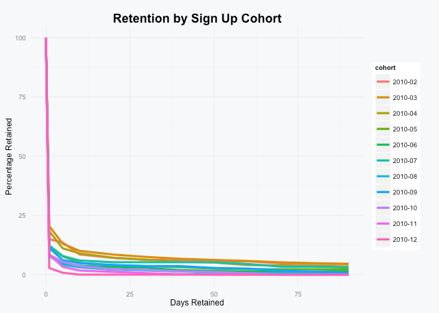
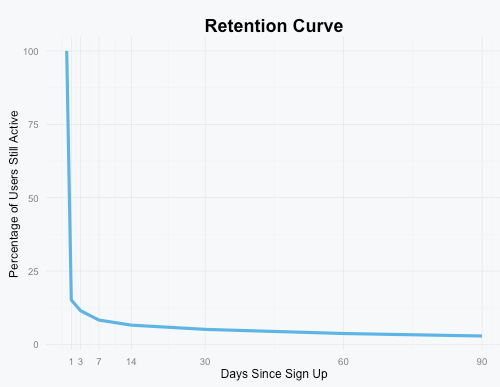

# Retentioneer

If you run a web or mobile app, you might be interested to know how long your users remain active. For example, did the users who signed up last January stick around longer than those who signed up this January? This script helps you figure it out.

## Installing R

If you've never used R before, you'll need to [install R](https://cran.r-project.org/mirrors.html) and optionally download a tool like [RStudio](https://www.rstudio.com/products/rstudio/download/) to run this script. You'll also need to install the `ggplot2` package with `install.packages("ggplot2")` and use `setwd()` to change the working directory to match the location of this script.

## How it works

In order for the script to work, all you need to do is to generate a CSV file containing a list of user ids and unix timestamps of when the users performed actions in your app.  Here's an example:

```
2,1270858427
2,1274045948
2,1274046075
3,1264910141
3,1264910158
3,1264910269
3,1264959922
4,1264959038
4,1286368585
```

The provided `data/test-data.csv` contains a test dataset that you can use to test the script.

To analyze the data, within RStudio simply load the script using `source("retentioneer.R")`.

If all went well, it will run the following code at the bottom of the file to analyze the test data:

`AnalyzeRetention("data/test-data.csv", cohort.units = "months")`

Which will generate output the following retention table:

```
    cohort days.retained users.retained retention.rate
1  2010-02             0            481    100.0000000
2  2010-02             1             72     14.9688150
3  2010-02             3             68     14.1372141
4  2010-02             7             60     12.4740125
5  2010-02            14             37      7.6923077
6  2010-02            30             30      6.2370062
7  2010-02            60             27      5.6133056
8  2010-02            90             22      4.5738046
9  2010-03             0           2742    100.0000000
10 2010-03             1            562     20.4959883
...
...
```

And generate the following chart:



If your data spans multiple years, you can specify `years` for the `cohort.units` argument:

`AnalyzeRetention("data/test-data.csv", cohort.units = "years")`

By default, a user counts as retained if they were active _on or after_ a specific date (the `method` argument is set to `on-or-after` by default). If you'd prefer users only count as retained if they were active _on_ a specific date, set `method = "on"`:

`AnalyzeRetention("data/test-data.csv", cohort.units = "months", method = "on")`

If you'd prefer to see the average retention rate across all of the cohorts, you can pass an `avg.only` argument set to `TRUE`.

`AnalyzeRetention("data/test-data.csv", avg.only = TRUE)`

```
  days.retained users.retained retention.rate
1             0           7424     100.000000
2             1           1126      15.167026
3             3            853      11.489763
4             7            616       8.297414
5            14            488       6.573276
6            30            381       5.132004
7            60            276       3.717672
8            90            213       2.869073
```



You can also adjust the minimum number of users required for a chort to be plotted (the default is 20):

`AnalyzeRetention("data/test-data.csv", cohort.units = "months", min.cohort.users = 50)`

You can hide the legend setting the `show.legend` argument to `FALSE` (default is `TRUE`):

`AnalyzeRetention("data/test-data.csv", cohort.units = "months", show.legend = FALSE)`

## Contact

If you have any suggestions, find a bug, or just want to say hey drop me a note at [@mhmazur](https://twitter.com/mhmazur) on Twitter or by email at matthew.h.mazur@gmail.com.

## License

MIT © [Matt Mazur](http://mattmazur.com)
